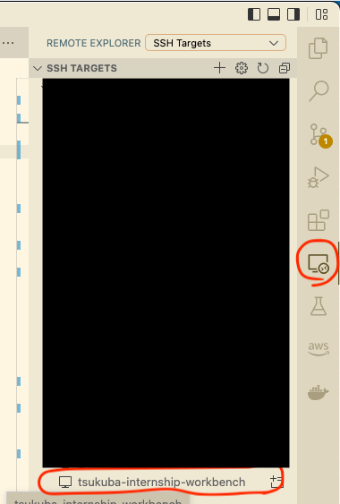
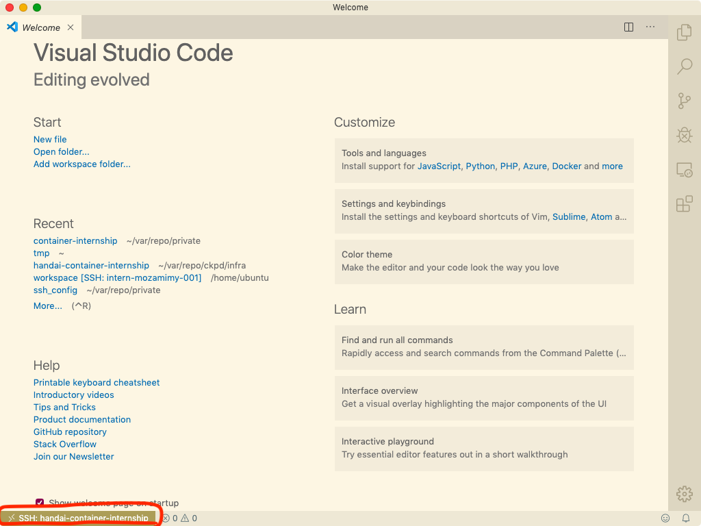
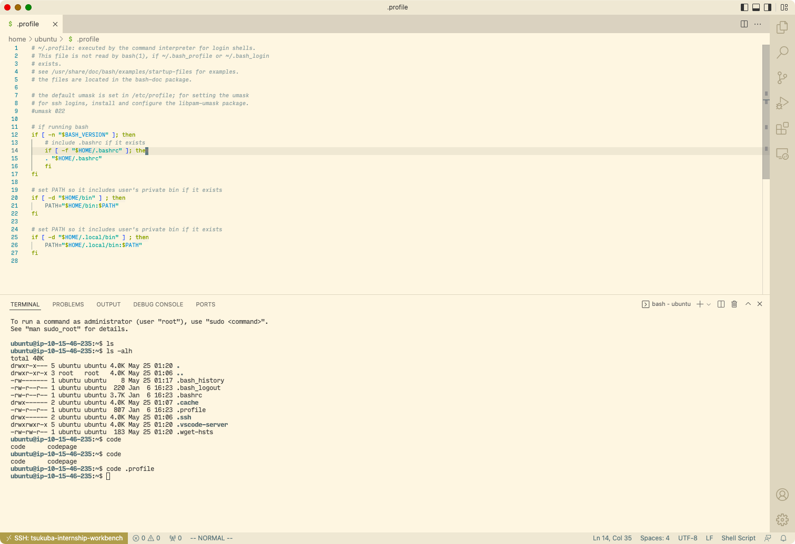

# Setup

講義を開始する前に、講義で使うためのインスタンスにログインする準備をします。皆さんには事前に、インスタンスの IP アドレスと、そのインスタンスにログインするための秘密鍵をお渡しします。

受け取った秘密鍵は、SSH ログインで利用可能なように、次の操作を行ってください。

```
$ chmod 600 id_rsa.handai-internship.pem
$ mv id_rsa.handai-internship.pem ~/.ssh
```

次に、~/.ssh/config に、インスタンスにログインするための設定を追加します。

```
Host handai-container-internship
  User ubuntu
  HostName ${インスタンスの IP アドレス}
  Port 22
  IdentityFile ~/.ssh/id_rsa.handai-internship.pem
```

では、VS Code から接続してみましょう。画面端の remote development のアイコンを探し、SSH TARGETS から、さきほど ~/.ssh/config に追加した handai-container-internship を探し、右クリックして「Connect to Host in Current Window」を選択します。もしくは、右の + マークのついた窓のアイコンをクリックすると、別ウィンドウで開くこともできます。



以下のスクリーンショットのような表示になっていれば、接続に成功しています。



その状態で、メニューバーの「View - Terminal」をクリックするか、Ctrl + ` を押すことで、VS Code 上でターミナルを開くことができます。適当にコマンドを打ち、動作確認してみてください。



インスタンス上で Vim を使いたい、エディタは VS Code でいいけれどターミナルは手に馴染んだものを使いたいといったように、ターミナルからログインしたい場合は、

```
$ ssh handai-container-internship
```

のようにしてください。

うまくログインが成功すればセットアップは完了です。
